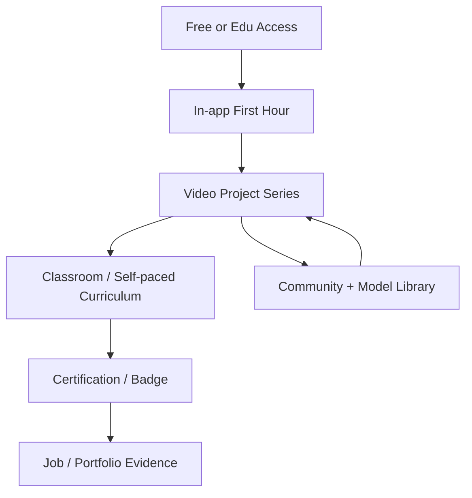

# CAD Education Research: How Professional Tools Are Taught — Implications for SolidExpress

**Date:** 2026-07-14  
**Scope:** SolidWorks, Autodesk Fusion, Onshape, FreeCAD, Autodesk Inventor  
**Purpose:** Inform SolidExpress education, onboarding, and community strategy as a free, non-GPL SolidWorks-oriented challenger.

---

## Executive summary

Professional CAD education is a **stack**, not a single channel. Highest uptake comes from (1) **YouTube / short video project series**, (2) **free-or-edu software + institutional curriculum**, (3) **industry-recognized certification** (especially SolidWorks CSWA/CSWP), (4) **in-product tutorials and learning paths**, and (5) **communities** (forums, Reddit, model libraries). Top programs win because they pair **zero-friction access** with **employer-visible credentials**, **teacher-ready packs**, and a **canonical first workflow**: sketch → constrain → extrude → edit intentionally.

Free/open alternatives (chiefly FreeCAD) under-deliver on **polished guided onboarding**, **career credentialing**, and **turnkey educator packs**—exactly where SolidExpress can differentiate if education ships as product, not afterthought.

**SolidExpress should:** ship an in-app “first hour” tutorial; publish a “Learn SolidExpress in 14 / 30 days” YouTube + downloadable lesson series; offer a free skills badge ladder aimed at SolidWorks-familiar learners; and give educators slide decks + starter `.sxp` packs—before pursuing a large certification bureaucracy.

---

## 1. Highest-uptake education modalities (with evidence)

Modalities are ordered by **reach × habit formation** in mechanical / product CAD, not by prestige alone.

### 1.1 YouTube and project-based video (highest informal uptake)

**Why it dominates:** CAD is spatial and procedural; learners need to watch hands and feature trees. Video is free, searchable, bingeable, and decoupled from licenses.

| Evidence | Detail |
|----------|--------|
| Official channels rank in CAD YouTube industry lists | Autodesk Fusion and SOLIDWORKS sit near the top of CAD-software channel rankings ([tubics CAD software rankings](https://www.tubics.com/rankings/industries/cad-software)). |
| SOLIDWORKS official channel scale | ~231K subscribers, ~36M views, thousands of videos ([tubics SOLIDWORKS channel](https://www.tubics.com/rankings/channel/UC0NX5l_sS-y14xc9XtPzsPw)). |
| Independent channels carry beginner load | e.g. CAD CAM Tutorials: ~656K subs, ~100M+ total views; top videos are SolidWorks “practice drawing” / beginner sketch series ([vidIQ stats](https://vidiq.com/youtube-stats/channel/@cadcamtutorials/)). |
| Flagship free courses | Product Design Online’s **Learn Autodesk Fusion in 30 Days** (updated 2026) is a widely cited complete beginner path with day projects + files ([productdesignonline.com](https://productdesignonline.com/learn-autodesk-fusion-360-in-30-days-official-course/); [Day 1 YouTube](https://www.youtube.com/watch?v=4G2E_DqQteM)). |
| Niche dynamics | Trend analyses note both long-form streams/tutorials and short-form “tips” growing in CAD education niches ([Trend-Analytic CAD tutorials](https://trend-analytic.com/en/categories/cad-engineering-tutorials)). |

**Pattern that works:** one small finished part per lesson; demo files; “tools used in 90% of designs” framing (sketch, extrude, shell, fillet).

### 1.2 Free / education software access (highest institutional gate-opener)

Access is half of pedagogy. Vendors compete on **removing install and license friction for schools**.

| Vendor | Access model | Sources |
|--------|--------------|---------|
| **Fusion** | Free for verified students/educators (full features); limited personal-use free for hobbyists; Mac/PC/Chromebook | [Autodesk Fusion education](https://www.autodesk.com/products/fusion-360/education); [tutorials hub](https://www.autodesk.com/solutions/design-manufacturing/fusion-tutorials) |
| **Onshape** | Browser CAD; free Student / Educator plans; Chromebook-viable | [Onshape education courses](https://www.onshape.com/en/education/courses-curriculum); Chromebook case study ([Oregon middle school](https://www.onshape.com/en/blog/oregon-middle-school-teacher-cloud-based-cad-levels-the-playing-field-for-disadvantaged-students)) |
| **SolidWorks** | Education Edition / Student Edition; certification vouchers bundled with student edition | [Student Edition instructions 2025](https://files.solidworks.com/education/solidworks_education_student_edition_instructions_2025_v1.pdf); [Academic Curriculum](https://www.solidworks.com/solution/solidworks-academic-curriculum) |
| **Inventor** | Free via Autodesk Education plan (bundled with broader Autodesk edu portfolio) | [Autodesk Education](https://www.autodesk.com/education/home/) |
| **FreeCAD** | Always free, no account; LGPL | [FreeCAD Getting Started](https://github.com/FreeCAD/FreeCAD-documentation/blob/main/wiki/Getting_started.md) |

**Market context:** Analyst summaries place Autodesk ~28–30% and Dassault/SOLIDWORKS ~18–20% of the **CAD-for-education** market, with PTC/Creo also material ([MarketIntelo CAD for Education](https://marketintelo.com/report/cad-for-education-market)).

### 1.3 Industry certification (highest career ROI signal)

Certification is the **career bridge** between classroom hours and job postings.

| Program | Notes | Sources |
|---------|-------|---------|
| **SolidWorks CSWA / CSWP / Academic** | Tiered (Associate → Professional → Expert specialties). Recommended ~150 hours classroom for CSWA-Academic; student edition includes exam vouchers; **&lt;60% global pass rate** cited for difficulty. Ecosystem claims **800,000+** certified users (Dassault “By the Numbers” 2024); Academic Curriculum page references 500k–770k+ depending on page vintage. | [CSWA-Academic](https://www.solidworks.com/certifications/solidworks-cad-design-academic); [CSWP](https://www.solidworks.com/certifications/solidworks-design-professional); [Student Edition PDF](https://files.solidworks.com/education/solidworks_education_student_edition_instructions_2025_v1.pdf); [By the Numbers PDF](https://www.solidworks.com/sites/default/files/2024-02/SOLIDWORKS_By_The_Numbers_Infographic_0.pdf); [500k milestone (2021)](https://my.solidworks.com/reader/wpressblogs/2021%252F02%252F500000-certified-users-a-program-that-has-changed-the-lives-of-many.html/500000-certified-users-a-program-that-has-changed-the-lives-of-many) |
| **Autodesk User / Associate / Professional / Expert** | Multi-product ladder (Fusion, Inventor, ACU for secondary); maps to state IRC lists / Perkins funding in US education discourse | [Autodesk Certification](https://academy.autodesk.com/); [Design & manufacturing certs](https://www.autodesk.com/certification/design-manufacturing-certification); [Education home](https://www.autodesk.com/education/home/) |
| **Certified Onshape Associate / Professional** | Browser-proctorable; used as CTE / IRC credential; Part Studios, assemblies, drawings, collaboration | [Educator resources / IRC](https://www.onshape.com/en/blog/educator-resources-cad-access-learning-materials-ircs); [Learning Center overview](https://www.onshape.com/en/blog/learn-cad-onshape-learning-center) |

Employer signal: SolidWorks remains among the most-cited **3D** CAD skills in job markets; CSWP is widely treated as a salary/employability differentiator in industry guides ([SimuTecra 2026 CAD guide](https://simutecra.com/blogs/best-cad-software-for-engineers); LinkedIn job-term claim on [SolidWorks By the Numbers](https://www.solidworks.com/sites/default/files/2024-02/SOLIDWORKS_By_The_Numbers_Infographic_0.pdf)).

### 1.4 In-app / Learning Center tutorials (highest *adjacent* uptake while designing)

Vendors put learning **inside the product** so the first session cannot end in confusion.

| Product | In-product learning | Sources |
|---------|---------------------|---------|
| **SolidWorks** | Help → Tutorials (Getting Started / Basic / Advanced); Welcome dialog **Learn** tab → MySolidWorks learning paths, sample files “On my PC”; Connected: step-by-step tutorials + Quick Tours | [Javelin built-in tutorials](https://www.javelin-tech.com/blog/2023/09/accessing-built-in-free-solidworks-tutorials/); [Learn Tab (help)](https://help.solidworks.com/2025/english/SWConnected/swdotworks/c_learn_tab.htm); [Welcome dialog](https://help.solidworks.com/2025/English/SolidWorks/sldworks/c_welcome_dialog_box.htm) |
| **MySolidWorks** | Hundreds of lessons + learning paths; guest free hours; subscription expands library; CSWA/CSWP prep paths | [MySolidWorks](https://my.solidworks.com/); [Training catalog](https://my.solidworks.com/training/catalog); [Innova overview](https://www.innova-systems.co.uk/mysolidworks-why-you-should-be-using-it/) |
| **Onshape Learning Center** | Pathways (CAD Basics, Fundamentals), Bootcamp, Intro to CAD semester pack, certificates of completion | [Learn CAD blog](https://www.onshape.com/en/blog/learn-cad-onshape-learning-center); [Courses](https://www.onshape.com/en/education/courses-curriculum) |
| **Fusion** | Autodesk Learning Pathways; “Learn Fusion in 90 minutes”; searchable curriculum by academic level | [Fusion tutorials](https://www.autodesk.com/solutions/design-manufacturing/fusion-tutorials); [IN education resources](https://www.autodesk.com/in/campaigns/education/resources) |
| **FreeCAD** | Wiki tutorials + community PDF manual (explicitly designed as friendlier path than the wiki) | [Tutorials list](https://github.com/FreeCAD/FreeCAD-documentation/blob/main/wiki/Tutorials.md); [A FreeCAD Manual (PDF)](https://www.freecad.org/manual/a-freecad-manual.pdf) |

### 1.5 Turnkey educator curriculum & standards mapping

High school / CTE adoption hinges on **teacher time**, not features.

- **Onshape Intro to CAD:** five units (~semester), scavenger hunt → skateboard → drawings/configs → collaborative printable project → open design; Google Docs slides + teacher/student guides + starter Documents ([Learning Center blog](https://www.onshape.com/en/blog/learn-cad-onshape-learning-center); [Educator resources](https://www.onshape.com/en/blog/educator-resources-cad-access-learning-materials-ircs)). Lessons tagged with time, difficulty, **CCSS / NGSS / CCTC / ISTE / STEL** ([Teacher tips blog](https://www.onshape.com/en/blog/projects-lessons-teacher-tips-learning-center)).
- **PLTW Engineering:** IED / POE pathways use CAD; Onshape markets Learning Center as deepen-on-top resource ([PLTW + Onshape](https://www.onshape.com/en/blog/pltw-engineering-curriculum)).
- **Fusion for educators:** free **12-hour Fusion Fundamentals** (US/Canada) CAD + optional CAM; prep toward ACU ([Fusion Fundamentals](https://www.autodesk.com/campaigns/education/fusion-fundamentals); [Fusion edu](https://www.autodesk.com/education/edu-software/fusion)).
- **SolidWorks Academic Curriculum:** Fundamentals of 3D Design & Simulation guides; CSWA/CSWP practice problem packs ([Academic Curriculum](https://www.solidworks.com/solution/solidworks-academic-curriculum)).
- **Autodesk Educator resource hub:** product-design modules for Fusion & Inventor ([Educator learning resources](https://www.autodesk.com/education/educators-learning-resources)).

### 1.6 Instructor-led classes, reseller training, and bootcamps

Still the default for **paid commercial seats**.

- **SolidWorks Authorized Training Centers / resellers:** GoEngineer, Hawk Ridge, etc. — classroom, virtual, on-site, self-paced; Essentials often ~$1,500–$2,000; completion certificates + cert prep ([GoEngineer training](https://www.goengineer.com/professional-solidworks-training); [Hawk Ridge Essentials](https://hawkridgesys.com/product/solidworks-essentials-course)).
- **Onshape Bootcamp:** ~10–12 hours over 4 days, live experts (esp. for migrants from desktop CAD); self-guided free variant ([Onshape Bootcamp](https://www.onshape.com/en/blog/what-is-onshape-bootcamp)).
- **University credit exam-prep:** e.g. UWF online CSWA/CSWP prep with vouchers ([UWF SolidWorks Exam Prep](https://uwf.edu/centers/institute-for-analytics-and-industry-advancement/iaia-certifications/industry-recognized-certifications/solidworks-exam-prep/)).
- **Autodesk Learning Partners / Certified Instructors:** formal channel for Fusion/Inventor delivery ([Autodesk training](https://www.autodesk.com/training-and-certification)).

### 1.7 Commercial on-demand specialist platforms

- **SolidProfessor:** 15,000+ short engineering videos; CSWA/CSWP prep; school + enterprise LMS; SOLIDWORKS task-pane add-in for just-in-time help; claims 200,000+ engineers helped ([SolidProfessor](https://solidprofessor.com/); [SolidWorks partner page](https://www.solidworks.com/partner-product/solidprofessor-on-demand-learning); [TriMech](https://trimech.com/solidprofessor-online-training/)).
- **LinkedIn Learning / Udemy / Skillshare:** long “Essentials” courses (e.g. [SOLIDWORKS 2027 Essential Training](https://www.linkedin.com/learning/solidworks-2022-essential-training) style catalogs)—high discovery, variable rigor.

### 1.8 Textbooks and academic homework ecosystems

- **SDC Publications** “Parametric Modeling with …” series (SolidWorks, Fusion, Inventor, Creo)—versioned annually, tutorial lessons, **CSWA-aligned exercise maps** ([SDC](https://www.sdcpublications.com/); [Parametric Modeling with SOLIDWORKS 2026](https://www.sdcpublications.com/Textbooks/Parametric-Modeling-SOLIDWORKS-2026/ISBN/978-1-63057-776-6/)).
- These remain the backbone of many university/community-college sections that need graded deliverables and offline workbooks.

### 1.9 Community Q&A, user groups, and model libraries

| Channel | Role |
|---------|------|
| Official forums (SolidWorks User Forum, FreeCAD forum) | 24/7 Q&A and expert social proof ([SolidWorks forum](https://forum.solidworks.com/); FreeCAD forum linked from [Getting started](https://github.com/FreeCAD/FreeCAD-documentation/blob/main/wiki/Getting_started.md)) |
| Reddit / Discord | Low-friction beginner help; screenshare culture ([Vagon learning roundup](https://vagon.io/blog/learn-solidworks-online-with-the-best-courses-and-resources)) |
| **GrabCAD** | Millions of shared files + tutorials; learning-by-inspecting native feature trees historically emphasized (~40% SW format cited in older community analysis); ~16M+ members claimed on site ([GrabCAD](https://www.grabcad.com/); [GrabCAD learning post](https://blog.grabcad.com/blog/2014/01/01/solidworks-learning-resource/); [SW tutorials](https://grabcad.com/tutorials/software/solidworks)) |
| User Group Networks | Local/regional SolidWorks user groups via vendor community portals ([MySolidWorks](https://my.solidworks.com/)) |

### 1.10 Synthesis: modality stack that “wins”

Commercial winners run this entire stack. FreeCAD mostly stops at **A + G + wiki C**, with weaker **B, D, E**.

---

## 2. What makes top education programs celebrated / effective

### 2.1 Design intent first, UI second

Celebrated curricula teach **why dimensions and constraints exist** (change without rebuild pain), not only which ribbon button to press. Textbook samples for SolidWorks and Fusion open with “rough sketch → constrain → feature” ([SDC Fusion sample](https://static.sdcpublications.com/pdfsample/978-1-63057-498-7-2-3kooeq58w7.pdf); [SDC SolidWorks sample](https://static.sdcpublications.com/pdfsample/978-1-63057-308-9-2-ynwrmw7c1n.pdf)). Onshape’s educator curriculum explicitly aims for design intent throughout ([Naomi Edwards quote](https://www.onshape.com/en/blog/learn-cad-onshape-learning-center)).

### 2.2 Project-based, finished objects every session

Skateboards, phone mounts, toy blocks, bottles—not abstract “hole wizard module 7.” Fusion 30-day and Onshape Intro to CAD are archetypes.

### 2.3 Teacher-as-customer packaging

Winning edu programs ship: lesson timing, slides, starter files, rubrics/exams, standards tags, assignment workflows (Onshape Teams/folders/assignments; Autodesk classroom setup). Educators cannot rebuild this from a wiki.

### 2.4 Credential that employers already recognize

SolidWorks’ certification flywheel (schools → vouchers → CSWA → job filter → more school demand) is the gold standard. Autodesk and Onshape explicitly chase **IRC / CTE** recognition for the same reason.

### 2.5 Train the trainers

Fusion Fundamentals, Onshape “Teaching a Class,” reseller Train-the-Trainer, Autodesk Certified Instructors—if teachers feel competent, software sticks for years of cohorts.

### 2.6 Migrate and equate skills

Onshape Bootcamp focuses on **SolidWorks veterans** learning new paradigms (multi-part Part Studios, branching). Fusion markets “transition from other software” shorts. Transfer paths reduce switching cost.

### 2.7 Just-in-time microlearning

SolidProfessor’s 3–7 minute task videos + add-in inside SolidWorks match how professionals actually learn after day five: search the stuck step, not replay a week-long course.

### 2.8 Platform accessibility

Cloud/browser (Onshape) and Chromebook (Fusion/Onshape messaging) democratize K-12. Hardware friction kills programs regardless of pedagogy quality.

---

## 3. Onboarding patterns for complex parametric CAD

Across SolidWorks, Fusion, Inventor, and Onshape, first-week pedagogy converges.

### 3.1 The canonical first pipeline

1. **Navigate 3D** (orbit/pan/zoom, view cube / standard views).  
2. **Sketch on a plane** — rough geometry, closed profile.  
3. **Geometric constraints** (H/V, parallel, coincident, tangent) **then dimensions**.  
4. **Fully defined sketch** (black vs blue under-defined cue in Fusion/SW-like UIs).  
5. **Extrude** (Join/Cut), then **fillet / shell**.  
6. **Feature history / timeline**: edit early feature; watch children update.  
7. **Second body / assembly**: mates or joints; simple drawing view.  
8. **Design change exercise**: alter a key dimension; fix breaks—teaches intent.

Sources teaching this sequence: Fusion beginner guides ([Mechmen](https://mechmansolution.com/blogs/fusion-360-beginner-guide/); [Renewed Tech parametric](https://aus.getrenewedtech.com/2024/10/26/parametric-modelling-in-fusion-360-designing-for-change/)); SDC parametric textbooks; Onshape units 1–2; SolidWorks Getting Started tutorials.

### 3.2 Guardrails taught early (or learned painfully)

| Practice | Rationale |
|----------|-----------|
| Anchor sketch to origin | Prevents model drift on regenerate |
| Closed profiles for solid extrudes | Avoids surface/open-loop failures |
| Constraints before driving dims | Reduces over-constraint conflicts |
| Name features / use named parameters | Timeline readability; design for change |
| Test parameter changes early | Fragility is cheapest to fix in first features |
| Prefer feature patterns over sketch pattern explosion | Performance / robustness (Fusion 30-day pedagogy) |

### 3.3 Conceptual layers beyond “draw pretty shapes”

Effective onboarding makes three ideas sticky:

1. **History-based modeling** — order matters; rolls back.  
2. **Under- vs over-constrained** — DOF color language.  
3. **Parent/child / topological identity** — why fillets break after sketch edits (SolidExpress already invests in naming services—teach that as a strength when ready).

### 3.4 Time boxes common in market offerings

| Format | Typical duration |
|--------|------------------|
| First project / “toy block” | 30–90 minutes |
| “Learn in 90 minutes” | Autodesk messaging |
| Bootcamp | 10–12 hours / 4 days (Onshape) |
| Educator intensive | 12 hours Fusion Fundamentals CAD |
| Semester Intro to CAD | ~9 weeks content (Onshape pack) |
| CSWA readiness | Often cited ~150 hours classroom envelope (Academic recs) |

### 3.5 Dual audience paths

Programs that scale maintain **two front doors**:

- **Never used CAD** → navigate → sketch → extrude → pride object.  
- **Came from SolidWorks/Fusion** → map terminology (Boss-Extrude ↔ Extrude, Mates ↔ Joints/Mates, FeatureManager ↔ Timeline) then highlight unique strengths.

SolidExpress, as a SolidWorks-oriented challenger, should optimize the **migrant** path especially hard.

---

## 4. Gaps in free / open alternatives (esp. FreeCAD)

FreeCAD is the principal OSS parametric desktop peer. Gaps below are **education and packaging** gaps, not pure kernel capability debates.

### 4.1 Steep, workbench-shaped first experience

New users must choose Part Design vs Part vs Draft vs Sketcher etc. Community and reviews repeatedly call this steeper / more confusing than Fusion or SolidWorks ([Autocad Everything comparison](https://autocadeverything.com/freecad-vs-solidworks/); [EuropeanStack FreeCAD review](https://europeanstack.com/software/freecad); [Nozzle Down 2026 comparison](https://nozzledown.com/solidworks-vs-fusion-360-vs-freecad-2026/); [HN thread](https://news.ycombinator.com/item?id=40432337)). G2 ease-of-use scoring historically favors SolidWorks over FreeCAD ([G2 compare](https://www.g2.com/compare/freecad-vs-solidworks)).

### 4.2 Wiki-as-documentation is reference-grade, not course-grade

The FreeCAD Manual authors themselves note gap: collaborative wiki is hard for newcomers; the manual was an experiment in linear pedagogy ([manual PDF intro](https://www.freecad.org/manual/a-freecad-manual.pdf)). No equivalent to Onshape’s editable Google-Doc classroom pack with timing and standards tags.

### 4.3 Weak employer-recognized credential

No widely valued **“Certified FreeCAD Associate”** sitting next to CSWA/ACU in job filters. Without credential gravity, school adoption for career pathways stalls even if the tool is free.

### 4.4 No funded train-the-trainer machine

Commercial vendors subsidize educator intensives because licenses convert to commercial seats later. OSS cannot fund Fusion Fundamentals-scale instructor academies by default—content quality varies by YouTuber luck.

### 4.5 Inconsistent UI polish and “broken day one” risk

Historical assembly pain, TNP issues (improving post-1.0), and UI roughness create early trust damage that tutorial volume cannot fully erase ([EuropeanStack](https://europeanstack.com/software/freecad); [HN](https://news.ycombinator.com/item?id=40432337)).

### 4.6 Fragmented learning marketplace

YouTube + forum + wiki + third-party blogs (e.g. [Scan2CAD 1-hour basics](https://www.scan2cad.com/blog/cad/freecad-basics/)) exist, but there is no single **official learning path** with progress tracking, quizzes, and example file syncing like MySolidWorks / Onshape Learning Center / Autodesk Learning.

### 4.7 Limited school IT story for Chromebooks / locked labs

Desktop-only installs struggle vs browser Onshape when districts standardize Chromebooks ([Onshape Chromebook narrative](https://www.onshape.com/en/blog/oregon-middle-school-teacher-cloud-based-cad-levels-the-playing-field-for-disadvantaged-students)).

### 4.8 Opportunity gap SolidExpress can claim

| Gap in OSS today | SolidExpress opportunity |
|------------------|--------------------------|
| Confusing first mode | Single “Part Studio” mental model closer to SolidWorks FeatureManager |
| No badge | Lightweight free skills badges + portfolio exports |
| Wiki soup | Curated Learning Path + in-app coach |
| Teacher packs | Semester kit with `.sxp` starters |
| Migrant friction | Explicit SolidWorks → SolidExpress command map |
| Community file culture | Shareable `.sxp` + STEP; optional model gallery |

License note: SolidExpress positioning as **free and non-GPL** matters to schools/vendors wary of copyleft in distribution—education messaging should state license clearly vs FreeCAD LGPL / GPL ecosystem assumptions.

---

## 5. Concrete teaching plan recommendations for SolidExpress

Assumptions from product status (2026): parametric timeline, PlaneGCS sketches, extrude/revolve, booleans, fillet/chamfer, variables, STEP/STL, semantic cards / AI context export, ViewCube-class UX in progress. Education should track what is **demo-stable**.

### 5.1 Guiding principles

1. **Education is a product surface**, not a marketing PDF.  
2. Optimize for **SolidWorks-familiar hobbyists, students, and makers** first; pure CAD novices second.  
3. Make the **first 60 minutes** produce a shareable part (photo + `.sxp`).  
4. Prefer **open video + starter files** over paywalled LMS until community exists.  
5. Use **badges before bureaucracy**—resume lines without Certiport-scale cost at first.  
6. Lean into **AI-first** differentiate: teach “ask the card / export context” as a learning superpower.

### 5.2 Phase A — Ship (0–3 months): First Hour + Learn in 14 Days

**A1. In-app Tutorial Mode (non-negotiable)**  
- Welcome → “Create your first part.”  
- Scripted: box or sketch rectangle → fully constrain → extrude → fillet → change dimension → undo.  
- Side panel steps (SolidWorks Tutorials / Onshape Quick Tour pattern).  
- Exit criteria: saved `my-first-part.sxp`.

**A2. Official YouTube: “Learn SolidExpress in 14 Days”**  
Day-sized (~15–25 min) projects. Example skeleton:

| Day | Project | Concepts |
|-----|---------|----------|
| 0 | Install & UI tour | Views, timeline, save |
| 1 | Spacer / washer | Sketch, constraints, extrude, hole |
| 2 | Phone stand | Multi-feature, fillet, variables |
| 3 | Bracket | Cut extrude, mirror, draft |
| 4 | Enclosure half | Shell, patterns |
| 5 | Parametric edit challenge | Timeline edit, naming survival demo |
| 6 | Instance / placement | Simple assembly precursor |
| 7–10 | Capstone (clamp, hinge leaf, or GoFumo-like print) | Full stack |
| 11–14 | Drawings-lite / STEP round-trip / AI context workflow | Interop + differentiation |

Release **starter `.sxp` + STEP** per day (PDO Fusion pattern).

**A3. One-page SolidWorks → SolidExpress cheat sheet**  
Boss-Extrude, Cut-Extrude, Smart Dimension, Mate ↔ SolidExpress equivalents; keyboard map. Host in repo `docs/learn/` and in Help menu.

**A4. Document landing: Learn hub**  
`docs/learn/README.md` with paths: Never used CAD | Coming from SolidWorks | Coming from Fusion/FreeCAD | Educator.

### 5.3 Phase B — Grow (3–9 months): Curriculum pack + community rituals

**B1. “Intro to CAD with SolidExpress” educator pack (9-week)**  
Clone Onshape structure, not Onshape IP:

- Unit 1: Navigate + scavenger hunt in sample assembly/doc.  
- Unit 2: Parts of a simple mechanical toy.  
- Unit 3: Variables + design change worksheet.  
- Unit 4: Pair project + 3D print optional.  
- Unit 5: Open design + portfolio write-up (export screenshots + AI context as reflection aid).  

Deliverables: slides (LibreOffice/Google), teacher guide (timing + common failures), student PDF, exam quiz bank, starter files.

**B2. Community**  

- Discord (#help-sketch, #show-and-tell, #from-solidworks).  
- Weekly “Model Drop”: ship a broken under-constrained sketch challenge.  
- Encourage GrabCAD / Printables style uploads of finished designs with “feature tree walkthrough” notes (semantic cards help here).

**B3. Micro-cert: SolidExpress Skills Badges (free)**  
Timed practical, files reviewed or auto-scored via headless tests where possible:

1. **Sketch Associate** — fully constrain profile; extrude; edit dim.  
2. **Part Fabricator** — cut, fillet, pattern, shell.  
3. **Parametric Designer** — variables + regenerate after upstream edit.  
4. **Interop Ready** — STEP import/export integrity checklist.

Publish verifier IDs (UUID) like CSWA electronic certificates—lightweight, no exam fee required at first.

**B4. Creator program**  
Early YouTubers get roadmap access + feature-request channels (Fusion creator economy lesson).

### 5.4 Phase C — Scale (9–24 months): Schools and career gravity

**C1. Student / classroom freemium**  
Keep software free; add classroom admin later (shared lesson packs, progress) only if demand appears—do not block on LMS.

**C2. Alignment docs** for NGSS / CTE / “industry credential substitute” language so teachers can justify adoption beside Onshape/Fusion.

**C3. Optional paid proctoring** only after badge volume exists—and market as **SolidWorks-transfer** exam (map CSWA task list to SolidExpress workflows) for résumé dual-listing.

**C4. Textbook partnership target**  
Approach SDC-style authors once UI stable year-over-year: “Parametric Modeling with SolidExpress”—credibility signal universities understand.

### 5.5 Pedagogy rules specific to SolidExpress’s architecture

| Product trait | Teaching implication |
|---------------|----------------------|
| PlaneGCS + DOF | Teach blue/under-defined early; surface solver diagnostics in UI |
| FeatureGraph + naming | Mid-tutorial exercise: rename faces/aliases, edit sketch, show survival |
| Semantic cards + AI export | Lesson: “Explain this feature tree to an AI / teammate” |
| OCCT-based exact geometry | Emphasize manufacturing/STEP truth vs mesh modelers |
| Non-GPL free | Messaging for schools and redistributors scared of FreeCAD-style license complexity |

### 5.6 What *not* to copy blindly

- Do not delay open video until a paid LMS exists.  
- Do not launch a hard CSWP-equivalent exam before UX polish—low pass rates without support kill trust (SolidWorks can afford &lt;60% pass rates; a challenger cannot).  
- Do not fragment learners across five workbenches on day one.  
- Do not assume wiki prose replaces project files.

### 5.7 Suggested 90-day education OKRs

| Objective | Key results |
|-----------|-------------|
| First-run success | ≥70% of tutorial starters finish extrude+save (instrument anonymously if possible) |
| Content surface area | 14-day playlist live; ≥10 starter files in repo |
| Community spark | Discord #show-and-tell ≥50 shared models |
| Educator readiness | 1 complete 3-week mini-unit (subset of semester pack) tested with 1 pilot teacher |
| Differentiation | 1 published lesson using semantic cards / AI context as learning aid |

### 5.8 Competitive positioning one-liner (education)

> **SolidExpress teaches the SolidWorks mental model—without the license wall—and adds AI-readable design intent from day one.**

Use that consistently against Fusion (cloud suite sprawl), Onshape (browser-only), FreeCAD (workbench maze), Inventor (Autodesk lock-in).

---

## Sources (selected URLs)

### SolidWorks / Dassault
- https://www.solidworks.com/certifications/solidworks-cad-design-academic  
- https://www.solidworks.com/certifications/solidworks-design-professional  
- https://www.solidworks.com/solution/solidworks-academic-curriculum  
- https://files.solidworks.com/education/solidworks_education_student_edition_instructions_2025_v1.pdf  
- https://www.solidworks.com/sites/default/files/2024-02/SOLIDWORKS_By_The_Numbers_Infographic_0.pdf  
- https://my.solidworks.com/  
- https://my.solidworks.com/training/catalog  
- https://help.solidworks.com/2025/english/SWConnected/swdotworks/c_learn_tab.htm  
- https://www.javelin-tech.com/blog/2023/09/accessing-built-in-free-solidworks-tutorials/  
- https://uwf.edu/centers/institute-for-analytics-and-industry-advancement/iaia-certifications/industry-recognized-certifications/solidworks-exam-prep/

### Autodesk Fusion / Inventor / Certification
- https://www.autodesk.com/products/fusion-360/education  
- https://www.autodesk.com/solutions/design-manufacturing/fusion-tutorials  
- https://www.autodesk.com/campaigns/education/fusion-fundamentals  
- https://www.autodesk.com/education/home/  
- https://www.autodesk.com/education/educators-learning-resources  
- https://academy.autodesk.com/  
- https://www.autodesk.com/certification/design-manufacturing-certification  
- https://www.autodesk.com/training-and-certification  
- https://productdesignonline.com/learn-autodesk-fusion-360-in-30-days-official-course/

### Onshape / PTC Education
- https://www.onshape.com/en/education/courses-curriculum  
- https://www.onshape.com/en/blog/learn-cad-onshape-learning-center  
- https://www.onshape.com/en/blog/educator-resources-cad-access-learning-materials-ircs  
- https://www.onshape.com/en/blog/projects-lessons-teacher-tips-learning-center  
- https://www.onshape.com/en/blog/what-is-onshape-bootcamp  
- https://www.onshape.com/en/blog/pltw-engineering-curriculum  
- https://www.onshape.com/en/blog/oregon-middle-school-teacher-cloud-based-cad-levels-the-playing-field-for-disadvantaged-students  
- https://learn.onshape.com/learning-paths/intro-to-cad  

### FreeCAD / OSS comparisons
- https://github.com/FreeCAD/FreeCAD-documentation/blob/main/wiki/Getting_started.md  
- https://github.com/FreeCAD/FreeCAD-documentation/blob/main/wiki/Tutorials.md  
- https://www.freecad.org/manual/a-freecad-manual.pdf  
- https://www.scan2cad.com/blog/cad/freecad-basics/  
- https://autocadeverything.com/freecad-vs-solidworks/  
- https://europeanstack.com/software/freecad  
- https://nozzledown.com/solidworks-vs-fusion-360-vs-freecad-2026/  
- https://www.g2.com/compare/freecad-vs-solidworks  
- https://news.ycombinator.com/item?id=40432337  

### Commercial training & community
- https://solidprofessor.com/  
- https://www.solidworks.com/partner-product/solidprofessor-on-demand-learning  
- https://www.goengineer.com/professional-solidworks-training  
- https://hawkridgesys.com/product/solidworks-essentials-course  
- https://www.grabcad.com/  
- https://grabcad.com/tutorials/software/solidworks  
- https://blog.grabcad.com/blog/2014/01/01/solidworks-learning-resource/  
- https://forum.solidworks.com/  
- https://vagon.io/blog/learn-solidworks-online-with-the-best-courses-and-resources  

### Textbooks & market context
- https://www.sdcpublications.com/  
- https://www.sdcpublications.com/Textbooks/Parametric-Modeling-SOLIDWORKS-2026/ISBN/978-1-63057-776-6/  
- https://static.sdcpublications.com/pdfsample/978-1-63057-498-7-2-3kooeq58w7.pdf  
- https://marketintelo.com/report/cad-for-education-market  
- https://simutecra.com/blogs/best-cad-software-for-engineers  
- https://www.tubics.com/rankings/industries/cad-software  
- https://vidiq.com/youtube-stats/channel/@cadcamtutorials/  

### Parametric pedagogy examples
- https://mechmansolution.com/blogs/fusion-360-beginner-guide/  
- https://aus.getrenewedtech.com/2024/10/26/parametric-modelling-in-fusion-360-designing-for-change/  
- https://autocadeverything.com/fusion-360-parametric-modeling/  

---

*Research compiled for SolidExpress product education planning. Figures (subscriber counts, market shares, certification totals) are vendor- or analyst-reported and should be re-verified before external marketing claims.*
