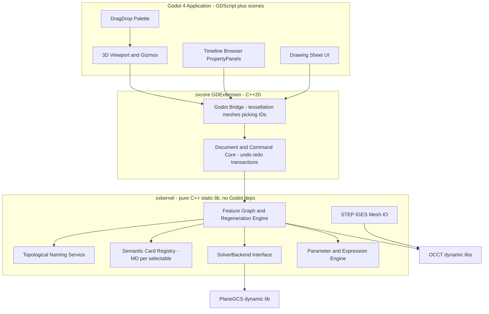
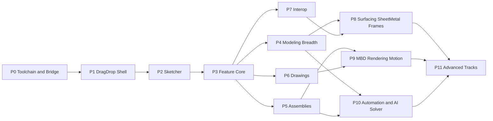

# solidexpress — Phased Implementation Plan

A long-running, agent-executable build plan for a parametric MCAD application, derived from the [feature survey](../survey/README.md). The scope target is the widest feature set in the [master feature list](../survey/master-feature-list.md), sequenced so the most common capabilities are built first and every phase is load-bearing foundation for the phases above it.

This plan is written to be executed **autonomously for long stretches without user input, with parallel workstreams**, by AI agents. Sections "Execution protocol" and the per-phase workstream tables encode how.

---

## 1. Product and technology decisions (fixed)

| Decision | Choice | Rationale |
|---|---|---|
| Language | C++20 | Required; OCCT and PlaneGCS are C++. |
| Rendering + UI | **Godot 4.x** via **GDExtension** (godot-cpp) | MIT license; mature viewport, input, UI toolkit; headless mode for tests. The app ships as a Godot project with the CAD kernel as a GDExtension shared library. |
| Geometry kernel | **Open CASCADE Technology (OCCT) 7.9+** | LGPL-2.1 with exception; the only credible non-GPL open B-rep kernel; ships STEP/IGES, HLR, fillets, booleans, tessellation. **Dynamic-link only** (LGPL §6 compliance). |
| 2D constraint solver | **PlaneGCS** (extracted from FreeCAD Sketcher) | LGPL-2.1-or-later — *not* GPL, acceptable. DogLeg/LM/BFGS/SQP solvers, redundancy diagnostics. **Dynamic-link, isolated behind our `SolverBackend` interface** so it can be replaced by the AI-first solver later. |
| Modeling paradigm | History-based parametric timeline + hybrid direct edits recorded as history features | The dominant industry approach (survey category 2/3); non-self-conflicting. |
| Assembly paradigm | **Mate connectors + DOF-typed joints** (Onshape/Fusion style) | The modern majority approach (4 of 7 surveyed products); fewer constraints per connection; maps cleanly onto the AI-selection future. |
| First UX | **Drag-and-drop direct manipulation**: drag primitives from a palette into the viewport, push/pull faces, drag joints together | Instant-gratification onboarding before the full sketch-constrain-feature workflow exists. |
| Document format | Zip container (`.sxp`): `manifest.json`, feature graph JSON, OCCT BREP blobs, thumbnails, and per-entity **semantic cards** (`cards/*.md`) | Zip-container single file is the common approach (3MF/docx pattern); cards are first-class from day one (see §3). |
| Units | mm internal, unit-aware parameter/expression engine | Industry default. |
| Default when in doubt | Do what the majority of the 7 surveyed products do | Standing instruction. |

### Licensing policy (hard rule: never integrate GPL/AGPL)

- **Allowed:** MIT, BSD, Apache-2.0, MPL-2.0, BSL-1.0, zlib, LGPL (dynamic-link only, keep sources/relink materials distributable).
- **Approved dependencies:** OCCT (LGPL+exception), PlaneGCS (LGPL-2.1+), godot-cpp (MIT), Eigen (MPL-2.0), nlohmann/json (MIT), spdlog (MIT), Catch2 (BSL-1.0), libzip (BSD), Clipper2 (BSL-1.0), Embree if needed later (Apache-2.0).
- **Known traps — banned:** libdxfrw (GPL-2) → write our own DXF writer (spec is open); Gmsh (GPL); CalculiX (GPL); Qt (avoid entirely — Godot UI instead). Every new dependency requires a license check recorded in `THIRD_PARTY.md` before first commit that uses it.

### Architecture

`sxkernel` never includes Godot headers — it is testable headless with plain Catch2 binaries. `sxcore` adapts it to Godot. This split is what makes fast, parallel, UI-free testing possible.

---

## 2. Execution protocol (autonomy, parallelism, model routing)

**Intent: run for many hours unattended, saturating parallel agents.** Rules:

1. **Coordinator loop.** A coordinator agent works phase by phase. Within a phase it launches the phase's workstreams as **parallel subagents in isolated git worktrees** (best-of-n-runner style), each owning a directory/subsystem to minimize merge conflicts. The coordinator merges a workstream only when its test gate is green, then immediately dispatches the next queued task. Never idle-wait: while a tricky workstream runs, dispatch rote workstreams from the same or next phase that don't depend on it.
2. **Model routing.** Every task in the phase tables carries a model tag:
   - **[F] = Fable 5** (`claude-fable-5-thinking-high`): architecture, OCCT integration edge cases, topological naming, solver integration, regeneration engine, picking/ID stability, anything with ambiguity or cross-cutting design impact.
   - **[G] = Grok 4.5** (`cursor-grok-4.5-high-fast`): rote/parallel-friendly work — repetitive feature subclasses, UI wiring, test scaffolding from an existing pattern, exporters, serialization boilerplate, docs, icon/palette plumbing.
   - Rule of thumb: the *first* implementation of a pattern is [F]; the *N-th* copy of that pattern is [G].
3. **Test gate (hard).** Every task defines happy-path tests **before or with** the implementation. A task is done only when `ctest` (kernel) and the headless Godot suite (`godot --headless -s res://tests/run_tests.gd`) pass in CI-equivalent local runs. A phase is done only when its exit-criteria suite passes. **No dependent task starts on a red gate**; independent tasks may proceed.
4. **Do not stop conditions.** Agents do not pause to ask about: naming, file layout within an owned directory, choice among approaches when the survey shows a majority approach, or test-fixture details. Agents *do* stop only for: license violations, decisions that contradict this document, or destructive operations.
5. **State files.** Progress is tracked in `docs/plan/STATUS.md` (phase/task checkboxes, updated on every merge) so any fresh agent can resume without context.

---

## 3. AI-first solver readiness (built in from Phase 0, swapped in Phase 10)

The long-term constraint solver will be **AI-first**: users (and agents) discuss selections and constraints in arbitrary natural language. The enabling design, mandatory from the start:

- **Stable entity identity.** Every selectable thing — face, edge, vertex, sketch entity, sketch constraint, feature, body, component, joint, drawing view — has a durable UUID that survives regeneration (this is the topological-naming service's job) and is the primary key everywhere (commands, serialization, tests).
- **Semantic cards.** Every selectable entity gets a generated **Markdown card** (`cards/<uuid>.md`) inside the document container, holding: UUID, entity type, geometric digest (type-specific: area, axis, radius, adjacency…), creating feature and parameters, relations to other cards, and free-text sections (`## Aliases`, `## Notes`) where users/AI attach arbitrary language ("the mounting boss face", "left hinge pin"). Cards regenerate their machine sections on every rebuild; free-text sections are preserved.
- **Solver abstraction.** All constraint solving goes through `SolverBackend` (add entities/constraints by UUID, solve, report DOF/conflicts). PlaneGCS is backend #1. The AI-first backend consumes semantic cards + intent statements and emits the same constraint primitives — swapping it requires no changes above the interface.
- **Selection queries.** The selection subsystem accepts UUID sets *and* declarative queries (type/adjacency/created-by filters) — the machine layer that language will compile onto.

Every phase below that creates a new selectable type must ship its card generator + card tests in the same task. This is a standing acceptance criterion, not repeated in every table row.

---

## 4. Phases

Dependency shape:

P4–P7 are mutually independent after P3 and **should run as parallel tracks**. P8+ tracks interleave.

---

### Phase 0 — Toolchain, kernel bridge, test harness

Goal: a skeleton where OCCT geometry appears in a Godot viewport, is pickable with stable IDs, and both test layers run headless.

| # | Task | Model | Happy-path test gate |
|---|---|---|---|
| 0.1 | Repo layout (`sxkernel/`, `sxcore/`, `game/`, `tests/`, `thirdparty/`), CMake superbuild fetching OCCT, godot-cpp, PlaneGCS, Eigen, Catch2; `THIRD_PARTY.md` license ledger | [F] | Clean build from scratch on Linux; `ctest` runs a trivial kernel test |
| 0.2 | `sxkernel` scaffold: Document, Body, entity UUIDs, command/transaction + undo/redo stack | [F] | Create box body → undo → redo; UUIDs stable across the cycle |
| 0.3 | Semantic card registry v1: card generation for bodies/faces/edges, MD serialization, free-text preservation on regen | [F] | Box body emits 1 body + 6 face + 12 edge cards; alias text survives a rebuild |
| 0.4 | Tessellation bridge: OCCT `BRepMesh` → Godot `ArrayMesh` with per-face sub-mesh → UUID mapping; normals, deflection control | [F] | Headless Godot scene shows box; mesh triangle count > 0; face→UUID map complete |
| 0.5 | Picking: GPU/raycast pick of faces/edges/vertices returning UUIDs; hover + selection highlight | [F] | Scripted ray at box center returns the expected face UUID |
| 0.6 | `.sxp` container save/load (zip: manifest, BREP blobs, cards) | [G] | Save → load → identical body count, UUIDs, card text |
| 0.7 | Test harnesses: Catch2 wiring, headless Godot test runner (`run_tests.gd`), CI script, golden-value helpers (volume/area/topo counts) | [G] | Both suites runnable by one `make test`; a deliberately failing test fails the gate |
| 0.8 | Logging (spdlog), crash-safe autosave stub, config file | [G] | Autosave file appears after a mutation |

Exit criteria: all gates green; `make test` runs kernel + headless UI suites in < 2 min.

Parallelism: 0.1→0.2 serial; then 0.3/0.4 parallel; 0.5 after 0.4; 0.6/0.7/0.8 parallel anytime after 0.2.

---

### Phase 1 — Drag-and-drop direct-manipulation shell

Goal: the first real user experience — no sketches yet, just tactile modeling.

| # | Task | Model | Happy-path test gate |
|---|---|---|---|
| 1.1 | Viewport navigation: orbit/pan/zoom, view cube, standard views, perspective/ortho, fit | [G] | Scripted camera commands land on expected transforms |
| 1.2 | Primitive palette + **drag-and-drop insertion** (box, cylinder, sphere, cone, torus, plane) with drop-point placement on ground/faces and live ghost preview | [F] | Simulated drag-drop of a box onto ground creates a body at the drop point |
| 1.3 | Transform gizmos: move/rotate/scale with snapping (grid, face-align) | [G] | Gizmo drag of body updates transform; snap lands on grid values |
| 1.4 | **Push/pull**: drag a planar face to offset it (prism add/cut via OCCT), the first direct-edit op, recorded as a history entry | [F] | Pull top face of box +10 mm → volume increases exactly by area×10 |
| 1.5 | Selection UX: click/box-select, filter by type, selection set panel showing semantic cards of selected items | [G] | Box-select returns expected UUID set; panel lists matching cards |
| 1.6 | Parameter panel v1: edit primitive dimensions numerically; unit parsing (mm/cm/in) | [G] | Set cylinder radius "1 in" → 25.4 mm geometry |
| 1.7 | Appearance basics: per-body/face color + material slot; ground grid, shadows | [G] | Assigned face color round-trips through save/load |
| 1.8 | Delete/duplicate/hide/isolate; structure browser (bodies list) | [G] | Duplicate produces new UUIDs with linked card lineage note |

Exit criteria: scripted headless "first session" test — drop 3 primitives, push/pull one, color one, save, reload, verify geometry + cards.

Parallelism: 1.1/1.2 first (1.2 is the pattern-setter); 1.3–1.8 largely parallel.

---

### Phase 2 — Sketcher (PlaneGCS)

Goal: full 2D parametric sketching, the foundation of everything parametric.

| # | Task | Model | Happy-path test gate |
|---|---|---|---|
| 2.1 | `SolverBackend` interface + PlaneGCS adapter (entities/constraints by UUID, solve, DOF report, conflict list) | [F] | Two lines + coincident + perpendicular solve to 90°; DOF count correct |
| 2.2 | Sketch document object: sketch on datum plane or planar face; sketch coordinate frame; edit-in/edit-out mode | [F] | Sketch on box top face has correct frame; face consumed via naming service |
| 2.3 | Entity set A: line, circle, arc, rectangle, point, construction geometry | [G] | Each entity creates, renders, emits card |
| 2.4 | Entity set B: ellipse, slot, polygon, fillet-in-sketch, trim/extend/split, offset | [G] | Trim splits at intersection; offset distance verified |
| 2.5 | Spline (B-spline fit + control-point) with PlaneGCS support | [F] | Fit spline through 5 points passes through all |
| 2.6 | Geometric constraints (coincident, tangent, parallel, perpendicular, concentric, equal, symmetric, midpoint, horizontal/vertical, fix) + dimensional (distance, angle, radius/diameter) | [G] after 2.1 pattern | Each constraint: apply → solve → geometric assertion (e.g. tangency distance < 1e-9) |
| 2.7 | Solver-state UX: under-defined blue / fully-defined black / over-defined red; conflict diagnostics; drag-to-solve interactive dragging | [F] | Fully constrained rectangle turns "black" state; drag attempt is a no-op |
| 2.8 | Constraint inference while drawing (auto horizontal/vertical/coincident/tangent) with suppress key | [F] | Drawing an axis-aligned line auto-adds horizontal constraint |
| 2.9 | Dimensions driven by expressions/variables (link to parameter engine) | [G] | `width = 2*height` updates on height change |
| 2.10 | Region/profile extraction: closed-loop detection producing faces for features | [F] | Two concentric circles yield an annular region |

Exit criteria: scripted test draws a fully-constrained mounting-plate sketch (rect + 4 holes + symmetric constraints), verifies DOF = 0 and region count.

Parallelism: 2.1/2.2 serial-first [F]; 2.3/2.4/2.6/2.9 fan out [G]; 2.5/2.7/2.8/2.10 [F] can overlap with the [G] lanes.

---

### Phase 3 — Feature modeling core (the parametric heart)

Goal: timeline, regeneration, topological naming, and the must-have features. This is the highest-risk phase; naming (3.2) is the single trickiest task in the plan.

| # | Task | Model | Happy-path test gate |
|---|---|---|---|
| 3.1 | Feature graph + regeneration engine: ordered timeline, dirty propagation, rollback bar, reorder, suppress, feature errors surfaced non-fatally | [F] | Edit sketch under 3 downstream features → all regenerate; suppress/unsuppress round-trips |
| 3.2 | **Topological naming service**: persistent references to faces/edges through rebuilds (history-based name graph on OCCT `BRepBuilderAPI` history + fallback geometric matching); powers cards and all downstream refs | [F] | Fillet referencing an edge survives: sketch resize, feature reorder, boolean overlap change |
| 3.3 | Extrude (add/cut/intersect/new-body; blind/through-all/to-face/symmetric; draft option) from sketch regions | [F] | Cut-through-all on plate leaves expected volume; refaces re-resolved by naming |
| 3.4 | Revolve (full/partial, add/cut) | [G] | 360° revolve of half-profile == analytic cylinder volume |
| 3.5 | Booleans as explicit features (unite/subtract/intersect between bodies) | [G] | Box minus cylinder volume matches analytic |
| 3.6 | Fillet (constant radius, multi-edge) + chamfer (distance, distance-angle) | [F] first, [G] variants | Fillet on box edge: volume within tolerance of analytic; naming survives |
| 3.7 | Shell (uniform, face removal) and draft (neutral plane) | [G] | Shelled box wall thickness verified by ray probes |
| 3.8 | Hole feature v1 (simple/counterbore/countersink on point placements) | [G] | Counterbore depths/diameters verified |
| 3.9 | Patterns: linear, circular, mirror (of features and bodies) | [G] | 3×4 linear pattern of hole → 12 instances, cards for each |
| 3.10 | Parameter/expression engine v2: global variables, cross-feature expressions, unit algebra, dependency-cycle detection | [F] | Variable change regenerates dependent features; cycle rejected with error |
| 3.11 | Feature edit UX: double-click timeline → property panel; failure badges with card-linked messages | [G] | Scripted edit of extrude depth via panel updates geometry |
| 3.12 | Direct edits as history features: move/offset/delete face recorded in timeline (upgrade of P1 push/pull onto naming service) | [F] | Delete-face heals; entry appears in timeline and replays on regen |

Exit criteria: "bracket" end-to-end test — sketch, extrude, shell, holes, fillet pattern, parameter edit at the root, full regen < 1 s, all references intact, save/load/regen identical (volumes + card set).

Parallelism: 3.1 and 3.2 first and mostly serial [F] (pair them); 3.3 next; then 3.4–3.9/3.11 fan out [G] wide; 3.10/3.12 [F] parallel to the fan-out.

---

### Phase 4 — Modeling breadth (track A after P3)

| # | Task | Model | Happy-path test gate |
|---|---|---|---|
| 4.1 | Sweep (path + optional guide, solid/thin) | [F] | Circle along arc path → torus-segment volume |
| 4.2 | Loft (multi-section, guide curves, start/end conditions) | [F] | Square→circle loft is closed, valid, expected volume band |
| 4.3 | Helix/coil (springs, modeled threads) | [G] | Helix pitch×turns == height |
| 4.4 | Rib, thicken, wrap/emboss text | [G] | Rib volume > 0 and attached to both faces |
| 4.5 | Variable-radius + full-round fillet; face fillets | [F] | Variable fillet endpoints measure r1/r2 |
| 4.6 | Multibody workflows: split body, combine, save bodies to parts | [G] | Split by plane yields 2 bodies with lineage cards |
| 4.7 | Derived/linked parts (insert part into part, associative) | [F] | Upstream edit propagates to derived copy |
| 4.8 | Configurations v1: named variants (parameter table + feature suppression) | [F] | Two configs produce distinct volumes from one document |
| 4.9 | Hole feature v2: standards library (ISO/ANSI sizes, tapped/clearance data tables) | [G] | M6 tapped hole minor diameter from table |
| 4.10 | Advanced patterns: curve-driven, sketch/point-driven, table-driven | [G] | Point-driven pattern instance count == points |

Exit criteria: modeled "pump housing" scripted build using ≥8 of the above passes with golden volumes.

---

### Phase 5 — Assemblies (track B after P3, parallel with P4)

| # | Task | Model | Happy-path test gate |
|---|---|---|---|
| 5.1 | Component/instance model: insert documents as components, transforms, instancing in Godot (MultiMesh where possible) | [F] | 100 instances of one part render; memory bounded; per-instance UUIDs |
| 5.2 | Mate connectors: implicit (face center/edge mid/vertex) + explicit user-defined frames; card per connector | [F] | Connector on cylindrical face has axis-aligned Z |
| 5.3 | Joints: fastened, revolute, slider, cylindrical, planar, ball, pin-slot; DOF solve (positioning via connector frame algebra, not a global solver) | [F] | Revolute joint leaves exactly 1 DOF; drag rotates about axis |
| 5.4 | Joint limits + drag animation of DOFs | [G] | Limit ±45° clamps drag |
| 5.5 | Drag-and-drop assembly UX: drag part from browser/palette, **snap-to-mate** on connector hover (magnetic) | [F] | Scripted drop of bolt onto hole connector creates fastened joint |
| 5.6 | Assembly patterns + mirror; flexible positioning of duplicate subassemblies | [G] | Circular pattern of 8 bolts around flange |
| 5.7 | Interference detection (static) + section view in viewport | [G] | Deliberate 1 mm overlap reported with volume |
| 5.8 | Exploded views (stored explode states with tweak paths) | [G] | Explode state round-trips save/load |
| 5.9 | In-context references v1: sketch on face of neighbor component with snapshot context (Onshape-style explicit update) | [F] | Neighbor edit does not change consumer until context update is invoked |
| 5.10 | Assembly BOM data model (item numbers, quantities, properties) | [G] | BOM of 3-part assembly has correct counts |

Exit criteria: scripted "gearbox" assembly — 12 components, joints of 4 types, pattern, explode, interference-clean — passes.

---

### Phase 6 — Drawings (track C after P3, parallel with P4/P5)

| # | Task | Model | Happy-path test gate |
|---|---|---|---|
| 6.1 | HLR projection service (OCCT `HLRBRep`) → 2D edge sets; drawing document type + sheets/scales/templates with title block fields | [F] | Front view of bracket: silhouette edge count stable golden |
| 6.2 | View types: standard/projected/isometric; section (full/offset); detail | [F] | Section through hole shows hatched region |
| 6.3 | Dimensions on views (linear, angular, radial/diameter, ordinate) anchored via naming UUIDs; associativity to model edits | [F] | Model edit moves dimension and updates value |
| 6.4 | Annotations: notes, leaders, center marks/lines, surface finish, basic weld symbols | [G] | Each annotation serializes + renders |
| 6.5 | GD&T v1: feature control frames, datum symbols (ASME/ISO symbol sets, graphical) | [G] | FCF renders with correct symbol glyphs |
| 6.6 | BOM table + balloons on assembly views (from 5.10) | [G] | Balloons match BOM item numbers |
| 6.7 | Sheet-metal flat pattern views + bend lines (fed later by P8; stub on multibody flat solids now) | [G] | Flat view shows bend-line layer |
| 6.8 | Export: PDF (vector) and **own DXF writer** (no GPL libdxfrw) | [F] DXF core, [G] PDF | Exported DXF re-imports in test parser with entity counts |

Exit criteria: fully dimensioned 2-sheet bracket drawing with BOM exports to PDF+DXF and survives a model edit with all dimensions intact.

---

### Phase 7 — Interoperability (track D after P3, small, parallel)

| # | Task | Model | Happy-path test gate |
|---|---|---|---|
| 7.1 | STEP AP214/AP242 import/export (OCCT XCAF: colors, names, assembly structure) | [F] | Export bracket → re-import → volume/part-count identical |
| 7.2 | IGES import/export | [G] | Round-trip surface count |
| 7.3 | Mesh export: STL (binary/ascii), OBJ, 3MF, glTF (via Godot) with deflection control | [G] | STL watertight for solid body; 3MF opens in test reader |
| 7.4 | Mesh import as reference bodies (STL/OBJ) rendered + measurable, not editable | [G] | Imported STL bbox matches source |
| 7.5 | Import healing pass (sewing, small-face removal) + import report card | [F] | Gappy IGES test file heals to a solid |
| 7.6 | DXF/DWG-lite 2D import into sketches (DXF read side of 6.8; DWG deferred — no non-GPL lib, note in report) | [G] | DXF polyline imports as sketch entities |

Exit criteria: STEP round-trip suite over 10 golden models green.

---

### Phase 8 — Surfacing, sheet metal, frames (after P4 + P7)

| # | Task | Model | Happy-path test gate |
|---|---|---|---|
| 8.1 | Surface features: extrude/revolve/sweep/loft as surface; trim, extend, untrim | [F] | Trimmed surface area golden |
| 8.2 | Offset, knit/sew to solid, thicken, boundary/fill (n-sided) surface | [F] | Knit 6 planes → solid box |
| 8.3 | Replace face / patch workflows on solids | [G] | Replace top face with lofted surface keeps solid valid |
| 8.4 | Curvature analysis display (zebra, curvature map) | [G] | Zebra shader renders on cylinder |
| 8.5 | Sheet metal core: base flange/tab, edge flange, hem, jog, bends with K-factor rules per material table | [F] | Flanged part unfolds: flat length matches bend-allowance formula |
| 8.6 | Flat pattern generation + bend table; DXF flat export (reuses 6.8) | [F] | Flat pattern area within tolerance of analytic |
| 8.7 | Sheet metal: corner relief, closed corner, convert-solid-to-sheet-metal | [G] | Converted thin box unfolds |
| 8.8 | Frames v1: structural members on 3D sketch paths from profile library (ISO/ANSI subset), miter/butt trim, cut lists | [G] | Rectangular frame: 4 members, mitered, cut-list lengths correct |
| 8.9 | Weld beads (cosmetic) + weld symbols to drawings | [G] | Fillet bead renders along edge; symbol appears in drawing |

Exit criteria: enclosure test — sheet-metal box with flanges + frame skeleton + flat-pattern drawing sheet, all golden.

---

### Phase 9 — MBD/PMI, rendering polish, motion (after P5 + P6)

| # | Task | Model | Happy-path test gate |
|---|---|---|---|
| 9.1 | 3D annotations (PMI): dimensions/notes/datums on model faces, annotation planes, saved annotation views; semantic storage on cards | [F] | PMI dimension attaches by UUID and survives regen |
| 9.2 | STEP AP242 PMI export (graphical + semantic basics) | [F] | Exported file contains PMI section referencing correct faces |
| 9.3 | PBR appearance system: material library, per-face appearances, decals; HDRI environment lighting | [G] | Material assignment round-trips; screenshot diff within threshold |
| 9.4 | Ray-traced still rendering path (Godot + optional Embree path later; start with Godot high-quality settings + screenshot pipeline) | [G] | Headless render produces image ≥ threshold SSIM vs golden |
| 9.5 | Turntable/exploded animations rendered to video | [G] | 60-frame turntable renders headless |
| 9.6 | Kinematic motion studies: drive joints over time, contact-free; interference-checked sweep | [F] | Crank-slider reaches expected positions at t samples |
| 9.7 | Measure tools (distance/angle/area/mass properties with material densities) | [G] | Mass of steel box == ρV |

Exit criteria: MBD'd part exports AP242 with PMI; gearbox motion study animates and screenshots match goldens.

---

### Phase 10 — Automation, APIs, and the AI-first solver swap (after P4 + P5)

| # | Task | Model | Happy-path test gate |
|---|---|---|---|
| 10.1 | Headless scripting API: full document/feature/assembly control exposed to GDScript + a JSON-RPC batch mode (CLI: open, edit, export) | [F] | Script builds the P3 bracket end-to-end headless |
| 10.2 | Selection query language v1 (typed filters: type/created-by/adjacent-to/geometric predicates) compiled to UUID sets | [F] | Query "cylindrical faces of feature X" returns the hole walls |
| 10.3 | Card enrichment pass: auto-generated natural-language digests on every card ("6 mm through hole on the left mounting tab") using adjacency + feature context | [F] | Digest strings exist and mention feature + placement for golden model |
| 10.4 | **AI-solver interface**: `IntentConstraint` layer — natural-language intent + referenced card UUIDs → normalized constraint primitives → `SolverBackend`; PlaneGCS remains the numeric core initially | [F] | Intent "make these two edges flush" (given 2 card UUIDs) emits coincident/parallel set and solves |
| 10.5 | LLM adapter harness (pluggable endpoint, offline-mockable) that maps arbitrary language → selection queries + intents, reading/writing card free-text | [F] | Mocked LLM round-trip test: language → query → intent → solved sketch |
| 10.6 | Equation/rules engine v2: conditional feature suppression (if/else on parameters), design tables (CSV) | [G] | Design table generates 3 config variants |
| 10.7 | Plugin surface v1: GDExtension add-on discovery, sandboxed doc API | [G] | Sample plugin adds a palette command |
| 10.8 | Batch/exporter automation + CLI regression runner used by CI | [G] | CLI converts folder of `.sxp` → STEP |

Exit criteria: headless natural-language demo (mocked LLM): "put four M6 clearance holes near the corners of the top face and make them symmetric" produces the correct constrained result.

---

### Phase 11 — Advanced tracks (parallel, ongoing backlog)

Ordered backlog, each item gated on its listed dependency; run as capacity allows, mostly [G] with [F] leads:

1. **Configurations v2 / design tables UI** (P4.8) — table editor, config-aware BOM/drawings.
2. **Advanced fillets** (P4.5): setback corners, curvature-continuous — [F].
3. **SubD/freeform spike** (P8): evaluate non-GPL SubD (OpenSubdiv, Apache-2.0) → B-rep conversion — [F] spike first.
4. **2.5-axis CAM spike** (P7): opencamlib (LGPL) adaptive clearing + our own post format — [F] spike.
5. **FEA hookup spike**: MFEM (BSD) or license-vetted alternative; linear static on tet mesh via OCCT meshing — [F] spike. (CalculiX/Gmsh are GPL — banned.)
6. **PDM-lite**: document vault with versions/branches on the `.sxp` container + card-aware diffs — natural fit with the card/UUID model.
7. **Routing v1**: 3D path sketch + swept pipe with bend tables.
8. **Mold basics**: parting line/surface analysis, core/cavity split.
9. **Point-cloud/scan import** and fit-plane/cylinder tools.
10. **Collaboration groundwork**: operational-transform-friendly command log (the command stack from 0.2 is already an op log).

---

## 5. Testing policy (applies to every task)

- **Kernel tests (Catch2)**: geometric assertions with numeric tolerances — volumes, areas, topology counts (faces/edges/shells), DOF counts, UUID stability. No screenshots.
- **Headless Godot tests**: `godot --headless` script runner driving the real UI scene tree — simulated input for drag-drop/gizmo/selection flows, screenshot SSIM comparisons only where geometry assertions can't capture the behavior (rendering, shaders).
- **Golden models**: `tests/golden/*.sxp` + expected-values JSON; every phase adds its exit-criteria model here. Goldens are regenerated only by an explicit, reviewed task.
- **Regression rule**: the full suite runs before any workstream merge; a merge that reddens an unrelated suite is reverted by the coordinator, not "fixed forward" by the workstream agent.
- Happy-path first (per instruction); edge-case tests accumulate opportunistically but never block a phase gate.

## 6. Risk register

| Risk | Mitigation |
|---|---|
| **Topological naming** (3.2) is the classic OCCT-app failure mode (FreeCAD's decade-long pain) | Treat as a first-class service with its own test battery from day one; Fable 5 only; fallback geometric matching; never reference raw OCCT shapes outside the service. |
| OCCT fillet/boolean robustness on hard inputs | Happy-path gates use well-conditioned geometry; wrap OCCT ops with validity checks (`BRepCheck`) and non-fatal feature errors (3.1). |
| Godot picking precision on dense meshes | Kernel-side exact ray-B-rep intersection for final hit resolution; GPU pick only for candidate culling. |
| PlaneGCS API drift (it's an extraction, not a formal SDK) | Vendor a pinned snapshot in `thirdparty/`, isolate behind `SolverBackend`, keep LGPL relink compliance (dynamic lib). |
| LGPL compliance mistakes | Dynamic-link OCCT + PlaneGCS; `THIRD_PARTY.md` ledger + license check as part of every dependency-adding task; prominent OCCT notice in About. |
| Long-running agents drifting from design | This document + `STATUS.md` are the source of truth; agents re-read both at task start; contradictions stop work (protocol rule 4). |
